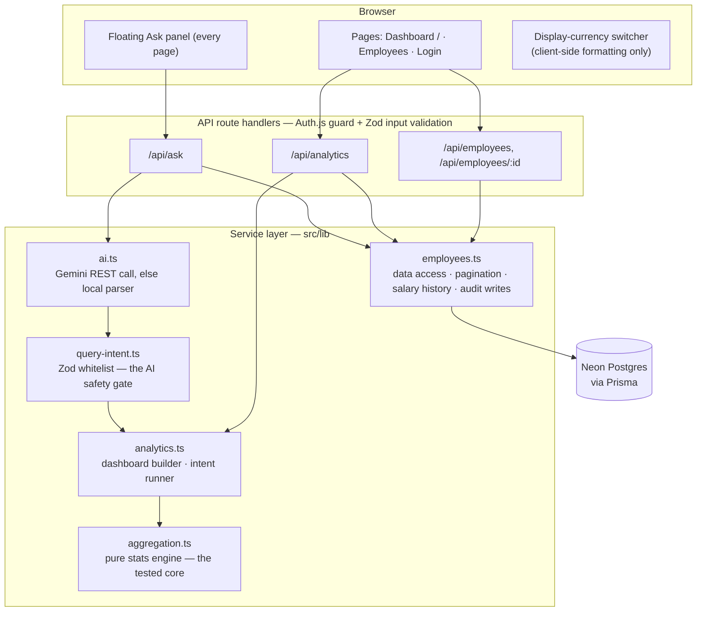

# Architecture

*Written before the build; updated after it so it describes what actually shipped. Where the
implementation deliberately diverged from the plan, the reasoning is in
[`docs/TRADEOFFS.md`](docs/TRADEOFFS.md) and the postscript of [`PLAN.md`](PLAN.md).*

## Stack
| Layer | Choice | Why |
|---|---|---|
| Framework | **Next.js (App Router) + TypeScript** | One repo, one deploy (Vercel). API via route handlers. Matches the Node/React JD. |
| DB | **Postgres (Neon) via Prisma** | Hosted serverless Postgres so the deployed demo and local dev share one setup. Schema is portable — a fully-offline reviewer can flip to SQLite with a two-line change (documented in `.env.example`). |
| UI | React + **Tailwind** + hand-built primitives (`src/components/ui.tsx`) | The console needed ~8 primitives (Button, Modal, Table…); a small dependency-free kit beat pulling in a component library. |
| Charts | **Recharts** | Simple, declarative, good enough for the analytics dashboard. |
| Validation | **Zod** | One schema style shared by API input validation and AI-output parsing. |
| Tests | **Vitest** (Testing Library configured) | Fast, deterministic, offline. Coverage is deliberately concentrated on the correctness core — see `docs/TRADEOFFS.md` → Testing. |
| Auth | **Auth.js (credentials)** | Single HR-Manager role; shows the auth seam without RBAC sprawl. |
| AI | **Gemini** (plain REST, free tier) with a **deterministic local parser** fallback | NL → structured-intent translation for Q&A. No SDK dependency; the feature works fully offline without a key. |

## System diagram

Reading the diagram: route handlers fetch rows through `employees.ts` (the only module that
talks to Prisma) and delegate **all math** to the pure modules on the right. The Ask path has
one extra hop — the model's raw output must pass the `query-intent.ts` Zod whitelist before
`analytics.ts` will execute it.

## Layered design (the key decision)
**The analytics dashboard and the AI Q&A share one aggregation service.** The AI does *not*
write SQL. Instead the LLM maps a question to a **structured intent**
(`{ metric: 'avg', field: 'salary', groupBy: 'country', filter: {...} }`) validated by Zod
against a **whitelist** of allowed metrics/fields. That intent runs through the *same* tested
service functions the dashboard uses. → Safe (no arbitrary SQL), deterministic to test, and
the AI can't do anything the dashboard couldn't.

## Data model
- **Employee**: id, name, email, country, department, jobTitle, level, hireDate,
  **isActive** (soft-delete flag — deletes never destroy data).
- **SalaryRecord**: id, employeeId, amount, currency, effectiveDate, isCurrent.
  History via multiple records: a raise closes the current record and opens a new one —
  supports raises/audit without mutation.
- **AuditLog**: id, entity, entityId, action, before(JSON), after(JSON), actor, timestamp —
  written on every mutation.
- Base-currency normalization via a static FX table (`fxRates` in `src/lib/reference.ts`) —
  static by design, see `docs/TRADEOFFS.md`.
- Indexes: Employee(country, department, level, isActive), SalaryRecord(employeeId,
  isCurrent), AuditLog(entity+entityId, createdAt).

## Performance considerations

### What 10k rows costs today
- **Employee table** — search, filters, and pagination all run **in Postgres** against the
  indexed columns: offset pages of 25 (`skip/take`) plus a parallel indexed `count`. The
  browser never receives more than one page.
- **Analytics & Ask** — one indexed query fetches only *current* salary rows of *active*
  employees, projected to five small fields (`amount, currency, country, department, level`).
  Those ~10k tiny objects are then aggregated **in memory by the pure engine**. At this scale
  that is single-digit milliseconds of JS; the payoff is that every formula (median, bands,
  comparisons, FX normalization) is deterministic, unit-tested TypeScript instead of logic
  spread across SQL strings. *(This deliberately diverges from the pre-build plan of DB-side
  aggregation — the trade-off is documented in `docs/TRADEOFFS.md`.)*
- **Charts** get pre-aggregated groups (a handful of bars/buckets), never row-level data.
- **Currency** — FX normalization is an in-process static table; switching the display
  currency re-formats on the client with **zero refetch**.
- **No caching layer** — aggregates are recomputed per request. At 10k rows that is cheap and
  always fresh; the analytics route is the natural seam to add `revalidate`/HTTP caching
  later.

### What changes at 1M rows
The service boundary is designed so each of these is a localized change, not a rewrite:
1. Move aggregation into SQL (`GROUP BY`, percentile functions) or a materialized rollup
   refreshed on salary mutations — routes keep the same response shape, the unit-tested
   engine becomes the oracle for the SQL's correctness.
2. Offset pagination → keyset (cursor) pagination; name search → `pg_trgm` index.
3. Cache dashboard aggregates and invalidate on mutation.
4. Static FX const → rates table with effective dates.

## AI safety
- LLM output → Zod-validated intent → whitelist check → parameterized service call.
- Read-only: the AI path can reach only the aggregation service and a capped (5 results),
  parameterized name search — no access to mutation services, no SQL, no code execution.
- Graceful degradation: with no API key (or a failed call) the **local deterministic parser**
  answers the common question shapes; a question neither can parse returns an honest
  "try rephrasing" message rather than a guessed answer. The app is fully usable without AI.
